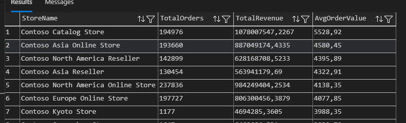
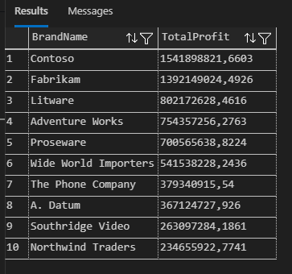

# 🛍️ Contoso Retail SQL Analytics : Store Sales

This SQL project showcases retail analytics using the `ContosoRetailDW` data warehouse. It focuses on in-store sales from the `FactSales` table and was built entirely with **SQL Server** and **Visual Studio Code**, following best practices for clean SQL, reusable views, and modular analysis. This project analyzes revenue and profitability trends from Contoso's in-store sales using only SQL — no BI tools or external code required.

## Skills Demonstrated
- SQL joins and filtering  
- Creating and querying SQL views  
- Data warehouse modeling (star schema)  
- Revenue and profitability analysis  
- Clean folder and project structure

## Tools Used
- SQL Server 2022  
- SQL Server Management Studio (SSMS)  
- Visual Studio Code (with SQL Server extension)

---

## Dataset: ContosoRetailDW

Microsoft's sample data warehouse simulating a retail business.  
This project focuses on the **store sales fact table** and related dimensions:

- `FactSales` — transactional sales data from physical stores
- `DimProduct`, `DimProductSubcategory` — product information
- `DimDate` — order dates
- `DimStore` — store metadata
- `DimGeography` — city/state/country of each store

---

## Data Cleaning: `vw_CleanedSales`

The view `vw_CleanedSales` was created to:
- Join all relevant dimensions to `FactSales`
- Convert surrogate keys into readable fields
- Filter out rows with 0 sales
- Compute profit (`SalesAmount - TotalCost`)

📁 Stored in `views/vw_CleanedSales.sql`

| Column | Description |
|--------|-------------|
| SalesKey | Transaction ID |
| OrderDate | Full order date |
| Subcategory | Product subcategory |
| ProductName | Name of the product |
| BrandName | Name of the Brand |
| StoreName | Store where the sale occurred |
| CityName | Store's city location |
| StateProvinceName | State or province |
| RegionCountryName | Country/region |
| SalesAmount | Revenue generated |
| TotalCost | Cost of goods sold |
| Profit | SalesAmount - TotalCost |
| SalesQuantity | Units sold |

---

## Analytical Queries

Stored in the [`queries/`](./queries/) folder:

- `sales_by_subcategory.sql`: Revenue by product subcategory
- `average_order_value_by_store.sql`: Average order by store

- `monthly_revenue_trend.sql`: Sales trend over time
- `profit_by_store.sql`: Total profit per store
- `revenue_by_country_state.sql`: Geographic revenue breakdown
- `top_brands_by_profit.sql`: Geographic revenue breakdown 



Each query is modular, readable, and ready to be reused in dashboards or reports.

---

## Example Query: Top 5 Brands by Profit

```sql
SELECT TOP 10
    BrandName,
    SUM(Profit) AS TotalProfit
FROM vw_CleanedSales
GROUP BY BrandName
ORDER BY TotalProfit DESC;

---

### Sample Output : Top 5 Brands by Profit

| BrandName       | TotalProfit      |
|-----------------|------------------|
| Contoso         | 1,541,898,821.66 |
| Fabrikam        | 1,392,149,024.49 |
| Litware         | 802,172,628.46   |
| Adventure Works | 754,357,256.27   |
| Proseware       | 700,565,638.82   |


